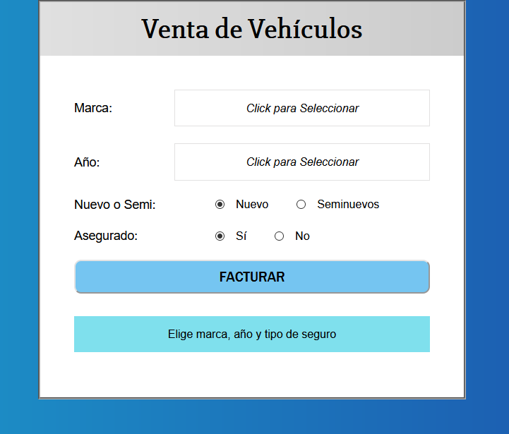

# Cotizador Vehicular :car:

Este  mini-proyecto tiene como objetivo sacar el monto a pagar de un vehículo dependiendo de sus características.

## Tecnologías :fire:
Solo estas herramientas se usaron para el FrontEnd 
 - React 
 - Hooks (*UseState*)
 - JS
 - HTML
 - CSS (*TransitionGroup / CSSTransition*)
 - Styled Components (*@emotion/styled*)
 - Netlify 
 
 ## Deployment :link:
 Para ir a probar la página vaya a este  :point_right: [enlace](https://venta-vehicular.netlify.app/)
